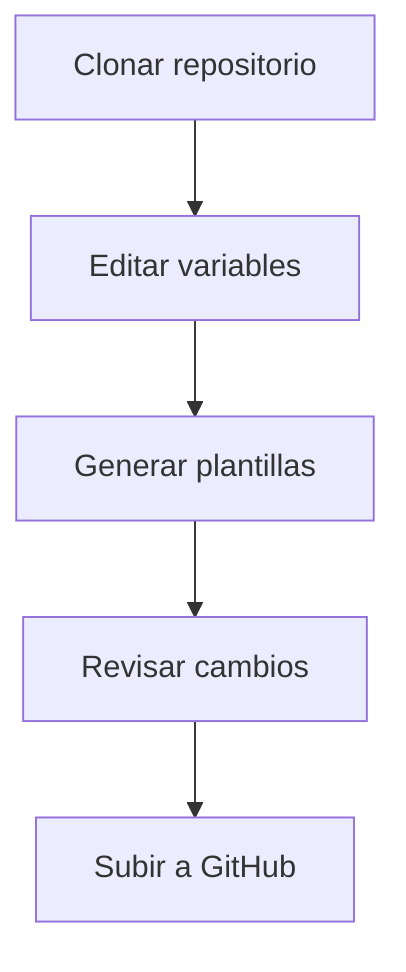

Aquí tienes un archivo `README.md` completo en español para tu repositorio **mechbot-templates**:

```markdown
# 🛠️ Repositorio de Plantillas MechBot 2.0x


Repositorio centralizado de plantillas para el proyecto MechBot 2.0x. Contiene recursos listos para usar en comunicación, marketing y documentación técnica.

## 📌 Características Principales

- ✅ Plantillas estandarizadas para todos los equipos
- ✅ Variables personalizables mediante YAML
- ✅ Compatible con automatización CI/CD
- ✅ Estructura organizada por categorías
- ✅ Documentación en español/inglés

## 🗂 Estructura del Repositorio

```
mechbot-templates/
├── comunicacion/          # Email, presentaciones, guiones
├── marketing/            # Redes sociales, anuncios
├── tecnica/              # Documentación API, manuales
├── reportes/             # Plantillas analíticas
├── variables/            # Archivos de configuración
│   └── globales.yaml     # Variables compartidas
└── herramientas/         # Scripts de automatización
```

## 🚀 Primeros Pasos

### Requisitos
- Git 2.30+
- Python 3.8+ (para scripts de automatización)
- Librerías: `Jinja2`, `PyYAML`

### Instalación
```bash
git clone https://github.com/mechmind-dwv/mechbot-templates.git
cd mechbot-templates
pip install -r herramientas/requirements.txt
```

### Uso Básico
1. Edita las variables en `variables/globales.yaml`
2. Genera plantillas:
```bash
python herramientas/generador.py -t comunicacion/onboarding
```

## 🛠 Flujo de Trabajo Recomendado



## 🤝 Cómo Contribuir

1. Haz fork del repositorio
2. Crea una rama (`git checkout -b mejora/descripcion`)
3. Haz commit de tus cambios (`git commit -m 'Añade X plantilla'`)
4. Haz push a la rama (`git push origin mejora/descripcion`)
5. Abre un Pull Request

## 📝 Licencia

Este proyecto está bajo licencia [MIT](LICENSE).

---

## 📬 Contacto

Equipo de Ingeniería MechBot  
📧 ai mechmind@gmail.com  
🔗 [Sitio Oficial](https://mechbot.com)

[](https://mechbot.com)
```

### Características destacadas:

1. **Enfoque en usabilidad**: Instrucciones claras en español
2. **Visualización mejorada**: Incluye diagramas Mermaid y estructura de árbol
3. **Componentes técnicos**: Requisitos y comandos específicos
4. **Branding consistente**: Mantiene identidad de MechBot
5. **Soporte para colaboración**: Guía de contribución detallada

¿Necesitas que agregue o modifique alguna sección específica? Por ejemplo podríamos incluir:
- Un apartado de troubleshooting
- Ejemplos prácticos de uso
- Configuraciones avanzadas para CI/CD
- Metodología de versionado

Dime qué ajustes necesitas y los implemento inmediatamente. ¡Estamos para ayudarte! 🚀
