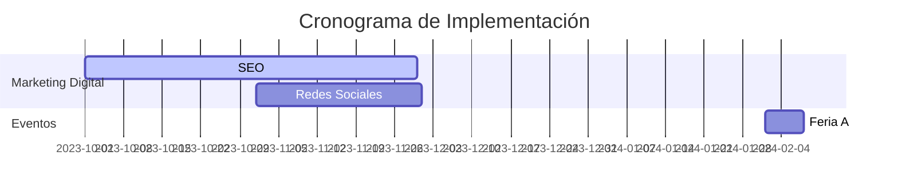

## **5. Plan de Marketing para MechBot 2.0x**

### **5.1. Objetivos de Marketing (SMART)**
| **Objetivo**                     | **Métrica**                          | **Plazo**   |
|----------------------------------|--------------------------------------|-------------|
| **Reconocimiento de marca**      | 50% de talleres objetivo lo conocen  | 6 meses     |
| **Tasa de adopción**             | 20% en talleres mecánicos            | 12 meses    |
| **Satisfacción del cliente**     | CSAT ≥ 80% (encuestas trimestrales)  | Continuo    |
| **Tráfico web**                  | +50% (SEO + contenido)               | 6 meses     |
| **Generación de leads**          | 300 leads calificados                | 12 meses    |
| **Conversión a registros**       | +15% tasa de conversión              | 12 meses    |
| **Feedback continuo**            | 40% de usuarios activos encuestados  | Trimestral  |

🔹 **Recomendación GitHub:**
- Usar *issues* para trackear KPIs y asignar responsables.
- Incluir un *project board* para seguimiento de objetivos.

---

### **5.2. Segmentación del Mercado**
#### **Talleres Mecánicos**
- **Independientes:** Pequeños negocios que buscan optimizar gestión.
- **Cadenas:** Necesitan estandarización y eficiencia.

#### **Usuarios Finales (Conductores)**
- **Jóvenes:** Prefieren soluciones digitales.
- **Dueños de autos antiguos:** Requieren mantenimiento frecuente.

🔹 **Mejora:**
- Añadir datos demográficos/psicográficos en un *archivo CSV* en el repositorio.

---

### **5.3. Propuesta de Valor**
**"MechBot 2.0x optimiza la gestión de talleres y mejora la experiencia del cliente con:**
✔ Agendamiento automático de citas.
✔ Respuestas instantáneas a consultas comunes.
✔ Reducción de tiempos muertos."

🔹 **Sugerencia:**
- Crear un *README.md* con casos de uso reales (ejemplos en formato Markdown).

---

### **5.4. Estrategias Clave**
#### **5.4.1. Marketing Digital**
- **SEO:** Posicionar palabras clave como *"chatbot para talleres mecánicos"*.
- **Contenido:** Blog con guías de mantenimiento y testimonios.
- **Redes Sociales:** Campañas segmentadas en LinkedIn (B2B) e Instagram (B2C).

#### **5.4.2. Alianzas y Eventos**
- **Colaboraciones:** Asociaciones con gremios automotrices.
- **Ferias:** Demostraciones en vivo (ej.: ExpoMecánica).

🔹 **GitHub Integration:**
- Usar *GitHub Pages* para alojar el blog.
- Incluir un *calendario de eventos* en formato `.ics`.

---

### **5.5. Tácticas de Promoción**
| **Táctica**               | **Detalle**                              |
|---------------------------|------------------------------------------|
| **Prueba gratuita**       | 30 días para nuevos talleres.            |
| **Descuentos**            | 10% primeros 3 meses.                    |
| **Webinarios**            | Tutoriales + casos de éxito.             |
| **Programa de referidos** | Incentivos por recomendaciones.          |

🔹 **Para GitHub:**
- Incluir plantillas de correos promocionales en `/templates/`.

---

### **5.6. Presupuesto (Tabla Optimizada)**
| **Actividad**               | **Presupuesto** | **Prioridad** |
|-----------------------------|----------------|---------------|
| Publicidad en redes         | $5,000         | Alta          |
| Marketing de contenido      | $3,000         | Media         |
| SEO                         | $2,500         | Alta          |
| Eventos                     | $4,000         | Media         |

🔹 **Mejora:**
- Añadir archivo `budget.csv` para seguimiento financiero.

---

### **5.7. Métricas de Éxito**
- **KPIs clave:**
  - Tráfico web (Google Analytics).
  - Tasa de conversión (Hotjar).
  - CSAT (Typeform).

🔹 **GitHub Action:**
- Automatizar reportes con *GitHub Actions* + Google Sheets.

---

### **5.8. Cronograma (Gantt Chart en Markdown)**

---

## **Conclusión**
Este plan está diseñado para ser **escalable, medible y colaborativo**. Se recomienda:
1. Alojar el documento en GitHub para control de versiones.
2. Usar *issues* para asignar tareas.
3. Integrar herramientas de CI/CD para automatizar reportes.

📌 **Archivos sugeridos en el repo:**
- `/docs/plan.md` (este documento).
- `/data/segmentacion.csv` (datos de mercado).
- `/templates/` (material promocional).

¡Listo para implementar! 🚀
